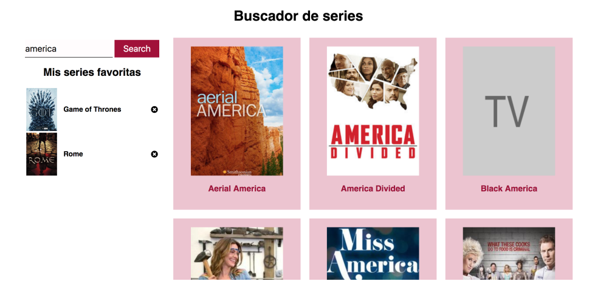

# Módulo 2 : Evaluación final.

Esta es mi resolución al ejercicio propuesto por el profesorado de Adalab para valorar las capacidades adquiridas durante el módulo 2.

En esta prueba he utilizado JavaScript principalmente dado que la materia a valorar en este módulo. Además para la maquetación he utilizado html y scss, así como utilizar como plantilla el Starter Kit de Adalab. 

La prueba consiste en crear una web de búsquedas de series que sea interactiva.

**Requisitos:**

- Al hacer click en el boton de buscar, la aplicación debe conectarse al API abierto de TVMAZE para búsqueda de series.

- Por cada show contenido en el resultado de búsqueda hay que pintar una tarjeta donde mostraremos una imagen de la serie y el título.

- En caso de que la serie no tenga imagen, debe mostrar una imagen de relleno.

- Pintar las series con innerHTML o con DOM avanzado.

- Al hacer click en algún resultado de busqueda, la imagen pasa al listado de favoritos de la izquierda y debe permanecer en esa posisicón aunque se realice otra busqueda. El color de fondo y de fuente se intercambia indicando que es una serie favorita.

- El listado de favoritos debe quedar almacenado en el localStorage y aparecer al recargar la pagina.

**Bonus:**

- Lista de favoritos: borrar cada elemento de manera independiente.
- Lista de busqueda: al hacer click en un elemento del listado de busqueda que ya es favorito se borra como favorito.
- Boton reset : lo borra todo.
- Buscador: Al volver a buscar una serie que ya es favorita deberia aparecer en el listado de busqueda marcada como favorita.
- Afinar la maquetación de la web.

>Diseño en el nos podiamos basar: 

